# RAG Document Intelligence System

A production-grade, local-first Retrieval-Augmented Generation (RAG) Document Intelligence System designed for advanced document analysis. Built using a robust Python (FastAPI) backend and a sleek, modern Next.js 16 (React) frontend styled with Tailwind CSS v4 and animated using Framer Motion.

---

## Key Features & Architecture

This application employs a high-performance hybrid retrieval pipeline utilizing state-of-the-art information retrieval patterns:

*   **Hybrid Search**: Combines semantic search (vector embeddings via `sentence-transformers/all-MiniLM-L6-v2` in ChromaDB) and keyword search (BM25 lexical scoring) to achieve highly relevant candidate selection.
*   **Reciprocal Rank Fusion (RRF)**: Merges keyword and vector search results using RRF ($k=60$) to balance the strengths of semantic context and precise keyword matching.
*   **Cross-Encoder Reranking**: Re-evaluates the top 20 candidates retrieved by RRF using a local Cross-Encoder model (`cross-encoder/ms-marco-MiniLM-L-6-v2`), narrowing them down to the top 5 most critical context chunks.
*   **DeepSeek V4 via OpenRouter**: Orchestrates advanced multi-query expansion (phrasing 2 alternative queries) and contextual generation using the DeepSeek model.
*   **Citations & Groundedness Verification**: 
    *   Generates inline citations matching actual retrieved source indices (e.g., `[SOURCE_1]`).
    *   A validator analyzes the model output, filters citations down to the source tags actually cited, and computes a dynamic confidence score (ranging from 10 to 95+) depending on citation completeness, fallback usage, and source matching.
*   **SQLite Metadata Engine**: Manages document processing state, chunks, query history, and analytics records.
*   **Modern Admin Dashboard**:
    *   **Document Library**: Interactive drag-and-drop file upload supporting PDF, DOCX, and TXT files, showing index status, size, and chunk count.
    *   **Chat Workspace**: Features timing metrics for each retrieval step (expansion, retrieval, reranking, generation) and dynamically renders cited source text blocks when hovering over or selecting inline citations.
    *   **System Analytics**: Visual dashboard tracking document indexing history, average generation confidence scores, and historical query logs.

---

## Workflow Architecture

The system operates via two core pipelines: **Ingestion** and **Query & Retrieval**:

```mermaid
graph TD
    %% Ingestion Pipeline
    subgraph Ingestion["1. Ingestion Pipeline"]
        Upload[File Upload: PDF / DOCX / TXT] --> Extract[Text Extraction: pdfplumber / python-docx]
        Extract --> Chunk[NLTK Sentence Tokenizer & Chunker]
        Chunk --> Embed[Sentence-Transformers Embeddings]
        Embed --> IndexChroma[ChromaDB Vector Index]
        Chunk --> IndexBM25[BM25 Lexical Index]
        IndexChroma --> SQLite[SQLite Document Metadata Store]
        IndexBM25 --> SQLite
    end

    %% Query Pipeline
    subgraph QueryPipeline["2. Query & Retrieval Pipeline"]
        UserQuery[User Question] --> Expand[Query Expansion: DeepSeek V4]
        Expand --> VectorSearch[Semantic Search: ChromaDB]
        Expand --> KeywordSearch[Lexical Search: BM25]
        VectorSearch --> RRF[Reciprocal Rank Fusion - RRF]
        KeywordSearch --> RRF
        RRF --> Rerank[Cross-Encoder Reranking]
        Rerank --> LLM[Generation: DeepSeek V4 Context Answer]
        LLM --> Validate[Groundedness & Confidence Scoring]
        Validate --> Response[Final Answer + Highlighted Citations]
    end
```



---

## Project Structure

```
rag-document-intelligence/
├── backend/
│   ├── api/
│   │   └── routes/             # Endpoints: documents, query, analytics
│   ├── db/
│   │   ├── database.py         # SQLite initialization and connections
│   │   └── queries.py          # SQLite database query functions
│   ├── generation/
│   │   ├── generator.py        # LLM contextual response generation
│   │   └── validator.py        # Groundedness evaluation and scoring
│   ├── ingestion/
│   │   ├── chunker.py          # NLTK token-aware text chunking
│   │   ├── embedder.py         # Local SentenceTransformer embeddings
│   │   ├── extractor.py        # PDF, DOCX, and TXT parser
│   │   └── indexer.py          # Vector (Chroma) and BM25 indexer
│   ├── models/
│   │   └── schemas.py          # Pydantic schema validation
│   ├── prompts/                # Prompt templates for LLM instruction
│   ├── retrieval/
│   │   ├── expander.py         # Query expansion engine
│   │   ├── reranker.py         # Local Cross-Encoder reranker
│   │   └── searcher.py         # Hybrid search engine (BM25 + Chroma + RRF)
│   ├── tests/                  # Pytest unit testing suite
│   ├── utils/
│   │   ├── logger.py           # Pipeline execution timer logs
│   │   └── openrouter.py       # OpenRouter API client wrapper
│   ├── main.py                 # FastAPI application root
│   └── requirements.txt        # Python dependency manifest
├── frontend/
│   ├── src/
│   │   ├── app/                # App Router pages: Dashboard, Chat, Analytics
│   │   ├── components/         # Reusable UI components (Sidebar, UploadZone, etc.)
│   │   ├── hooks/              # Custom React hooks (useChat, useDocuments)
│   │   └── lib/                # API client helper and TypeScript types
│   ├── next.config.ts          # Next.js configurations
│   ├── package.json            # Node dependency manifest
│   └── tsconfig.json           # TypeScript configuration
├── rag_system.db               # Local SQLite database (auto-generated)
├── chroma_data/                # Local ChromaDB persistent database (auto-generated)
└── README.md                   # Project documentation
```

---

## Getting Started

### Prerequisites
*   Python 3.11+
*   Node.js 18+

### 1. Backend Setup (FastAPI)
1.  Navigate to the backend directory:
    ```bash
    cd backend
    ```
2.  Install Python dependencies:
    ```bash
    pip install -r requirements.txt
    ```
3.  Configure your local environment. Create a `.env` file in the `backend/` directory using `.env.example` as a template:
    ```env
    OPENROUTER_API_KEY=your_openrouter_api_key_here
    LLM_MODEL=deepseek/deepseek-chat
    DB_PATH=rag_system.db
    ```
4.  Run the API server from the project root directory:
    ```bash
    cd ..
    uvicorn backend.main:app --reload --port 8000
    ```
    *The server will initialize the SQLite database (`rag_system.db`) and download the local models (`all-MiniLM-L6-v2` and `ms-marco-MiniLM-L-6-v2`) on its first launch.*

### 2. Frontend Setup (Next.js)
1.  Navigate to the frontend directory:
    ```bash
    cd frontend
    ```
2.  Install Node dependencies:
    ```bash
    npm install
    ```
3.  Run the Next.js development server:
    ```bash
    npm run dev
    ```
4.  Open [http://localhost:3000](http://localhost:3000) in your web browser to upload documents and begin testing the pipeline.

---

## Running Verification & Tests

### Backend Unit Tests
We use `pytest` to verify individual components in the retrieval, chunking, and validation layers. Run the test suite from the project root:
```bash
python -m pytest
```

### Production Build
To verify type-checking and Next.js compiler correctness, build the production Next.js bundle:
```bash
cd frontend
npm run build
```
